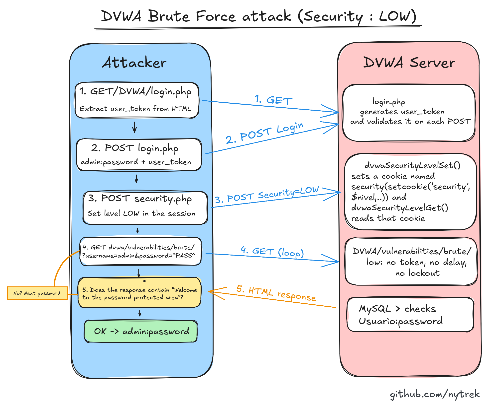
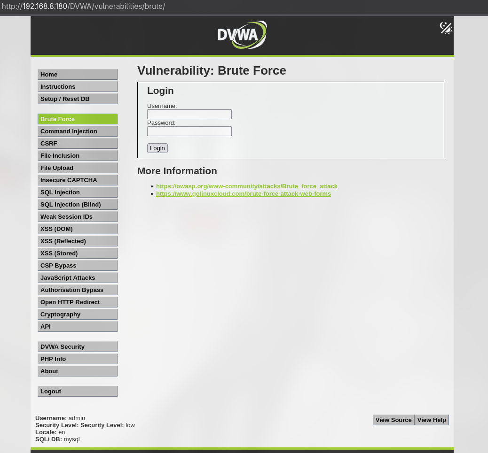
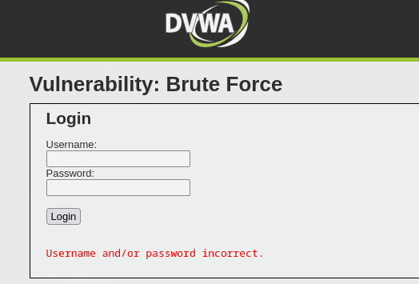
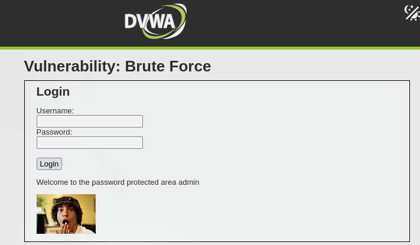
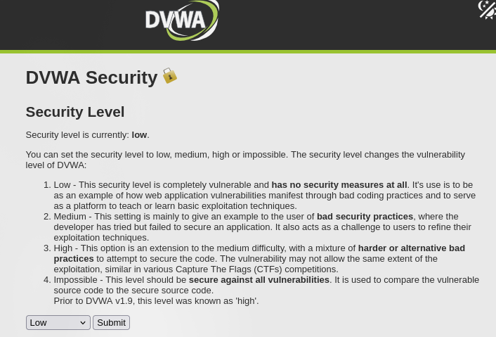
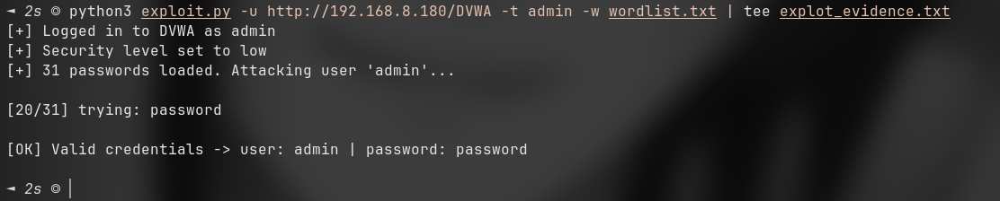

# Brute Force — Low

DVWA's Brute Force page is a login form for a second set of credentials
(`admin` and friends), separate from the DVWA app login. On the low security
level the form has nothing stopping automated guessing: no token tied to the
request, no delay, no lockout. So the whole thing comes down to throwing a
wordlist at it and watching for the response that means "you're in".

- **Target:** `/vulnerabilities/brute/`
- **Level:** low
- **Goal:** recover a valid `username:password` for the brute-force form
- **Result:** `admin:password`



## The form

The login form submits over GET, so a guess is just a URL:

```
GET /vulnerabilities/brute/?username=admin&password=letmein&Login=Login
```



Two responses matter:

- Wrong: `Username and/or password incorrect.`
- Right: `Welcome to the password protected area admin`

That success string is the oracle. Every guess is one request, and I check the
body for that line. `exploit.py` matches on the substring
`"Welcome to the password protected area"` — if it's in the response, the guess
was right.





## Why it's vulnerable

The low source (`vulnerabilities/brute/source/low.php`) does this:

```php
$user = $_GET[ 'username' ];
$pass = $_GET[ 'password' ];
$pass = md5( $pass );

$query  = "SELECT * FROM `users` WHERE user = '$user' AND password = '$pass';";
$result = mysqli_query($GLOBALS["___mysqli_ston"], $query);

if( $result && mysqli_num_rows( $result ) == 1 ) {
    $row = mysqli_fetch_assoc( $result );
    echo "<p>Welcome to the password protected area {$user}</p>";
    ...
} else {
    echo "<pre><br />Username and/or password incorrect.</pre>";
}
```

There's no protection against automation anywhere in this handler:

- **No request token.** The DVWA app login (`login.php`) generates a
  `user_token` and checks it on every POST, but this brute form doesn't require
  one. Nothing ties a guess to a real browser session, so I can fire requests as
  fast as I want.
- **No delay.** The response comes back immediately whether the guess is right
  or wrong. Nothing slows a script down.
- **No lockout.** Wrong guesses never lock the account. There's no cap on
  attempts.
- Credentials go in the URL over GET, so they'd also land in server logs and
  browser history — bad on its own, and convenient for an attacker.

(The handler is also injectable through `$user`, but that's the SQL Injection
writeup. Here I'm only using the automation weakness.)

## Getting to the page

The brute form lives behind the DVWA session, so before looping I need a valid
session at the low level. Three steps, all reusable for later modules:

1. `GET /login.php` and scrape `user_token` out of the HTML (hidden input).
   The regex in the script is `user_token['"]\s+value=['"]([a-f0-9]+)['"]`.
2. `POST /login.php` with `admin:password` plus that token to authenticate.
3. `POST /security.php` with `security=low` (plus a freshly scraped token) to
   pin the level for this session.

After that the session cookie (`PHPSESSID`) plus `security=low` gets me into the
brute page, and I can start guessing.



## Exploitation

`exploit.py` does the three setup steps, then loops a wordlist against the brute
endpoint and stops on the success string. It keeps one `requests.Session` so the
cookies carry across login, level, and every guess.

The flags it actually takes:

- `-u`/`--url` — base DVWA URL (required), e.g. `http://192.168.1.180/DVWA`
- `-t`/`--target` — the username to attack on the brute form (required)
- `-w`/`--wordlist` — path to the password list (required)
- `--dvwa-user` — user to log into DVWA with (default `admin`)
- `--dvwa-pass` — password to log into DVWA with (default `password`)
- `--delay` — seconds between attempts (default `0.1`)

```
python3 exploit.py -u http://localhost/DVWA -t admin -w wordlist.txt
```

What it does, in order:

1. `login()` — scrape the token from `login.php`, POST the DVWA credentials, and
   fail loud if it lands back on `login.php` or sees `Login Failed`.
2. `set_security_level()` — scrape the token from `security.php` and POST
   `security=low`.
3. `brute_force()` — read the wordlist, and for each candidate send
   `GET /vulnerabilities/brute/?username=<target>&password=<candidate>&Login=Login`.
   The hit is detected with
   `"Welcome to the password protected area" in resp.text`; on a match it prints
   the credentials and returns. `--delay` sleeps between requests.

Real run against my local DVWA (trimmed):

```
[+] Logged in to DVWA as admin
[+] Security level set to low
[+] 31 passwords loaded. Attacking user 'admin'...

[20/31] trying: password

[OK] Valid credentials -> user: admin | password: password
```

Found on attempt 20 of 31: `admin:password`.



The full script is in [`exploit.py`](exploit.py).

## Fixing it

The higher levels show the actual defenses (I've only exploited low so far —
these are from reading the source, not runs I've done):

- **Medium** adds `sleep(2)` on a failed login. It doesn't fix anything, it just
  slows a script down — and since the delay is only on failure, it's a weak
  speed bump, not a control.
- **High** requires a `user_token` on the brute form too, regenerated each
  request, so a naive loop breaks: every guess first needs a fresh token scraped
  from the previous response. It raises the bar but a script that re-scrapes the
  token each time still works.

What would actually stop this in the real world: rate limiting per IP/account,
account lockout with backoff after N failures, a CAPTCHA after a few misses,
alerting on bursts of failed logins, and not passing credentials over GET.
Password hashing here is `md5` with no salt, which is broken regardless — real
systems use bcrypt/argon2.

## What I learned

- The success/failure oracle is the whole game in brute forcing. Find the string
  (or response length, or status code) that reliably splits the two, and the
  rest is just iterating.
- Anti-automation and password strength are separate problems. Low fails at
  anti-automation; the `md5` hashing is a second, independent weakness.
- Keeping the session and re-reading state (the token on high) is what separates
  a script that works from one that gets a wall of "incorrect".

## References

- DVWA source: https://github.com/digininja/DVWA
- OWASP: Blocking Brute Force Attacks
